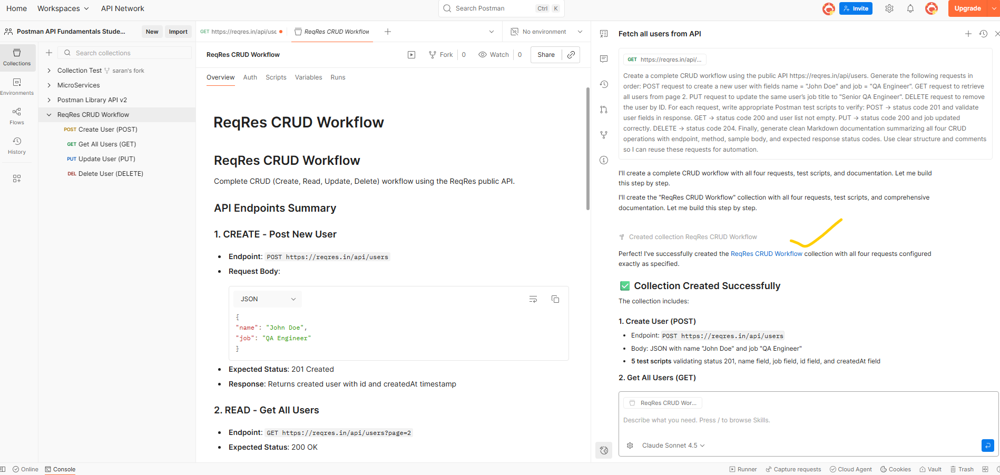
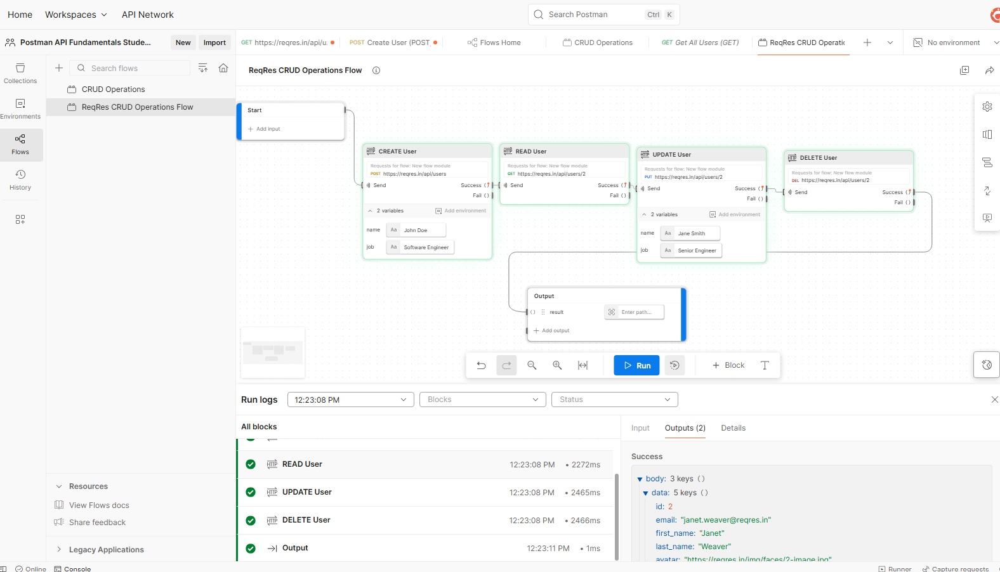

# 🤖 Postman AI Agent + Visual Flows: Building Smart API Workflows Without Code! 🚀

Transforming API automation with Postman's powerful combination of **AI-driven development** and **visual workflow design**.

---

## 🎯 Overview

I built a complete **CRUD workflow automation** using the **ReqRes API**, leveraging both **Postman AI Agent** and **Visual Flows** — the results were mind-blowing! 🤯

---

## 🎨 Visual Flows — Build APIs Without Code!

Using Postman’s visual programming interface, I designed a seamless 4-step CRUD workflow:

🧩 **START → CREATE User → READ User → UPDATE User → DELETE User → OUTPUT**

### 💡 Highlights:
✨ Drag-and-drop simplicity for request chaining  
⚡ Real-time execution with detailed logs  
🧠 Conditional logic for success & failure paths  
🔄 Data transformation and response mapping  

🖼️ *Screenshots:*  
📸 Below are visuals showing my workflow and execution results:  
  


---

## 🤖 AI Agent — Your Intelligent API Co-Pilot

💬 **Natural Language Commands:**  
🗣️ “Create a POST request to add a user” → ✅ Done  
🧩 “Add tests to verify response code is 200” → ⚙️ Instantly generated  
🧰 “Fix the authentication error” → 🐛 Debugged in seconds  

🧠 **Smart Test Generation:** One command creates validations for response codes, schemas, and structures.  
🐛 **Intelligent Debugging:** Detects and fixes missing headers or bad responses.  
✅ **Complete AI-Generated CRUD Collection:** From POST to DELETE, all validated and reusable!  

---

## 🧭 Implementation Guide: Using Postman Flows + AI Agent from Scratch

### 🧩 Step 1: Setup Postman Workspace
- 🏗️ Open **Postman Desktop App or Web**.  
- ➕ Click on **New → Flow** to create a new visual workflow.  
- 🧠 Enable **AI Agent** (ensure you’re signed in to your Postman account).  

### 🧠 Step 2: Use the AI Agent
Ask the AI Agent directly using natural language commands:  
> “Create a POST request to add a user using ReqRes API”  
> “Add tests to verify response code is 201 and name field is returned”  
💡 Postman auto-generates the requests and tests!  

### 🎨 Step 3: Build the Visual Flow
Drag and drop blocks to visually connect your CRUD flow:  
```
START → CREATE (POST) → READ (GET) → UPDATE (PUT) → DELETE → OUTPUT
```
Use variables to pass data between blocks (e.g., user ID).  

### ⚙️ Step 4: Configure Each Request
| Step | Method | Endpoint | Purpose |
|------|---------|-----------|----------|
| 1️⃣ | POST | https://reqres.in/api/users | Create a new user |
| 2️⃣ | GET | https://reqres.in/api/users/{{userId}} | Fetch created user |
| 3️⃣ | PUT | https://reqres.in/api/users/{{userId}} | Update user details |
| 4️⃣ | DELETE | https://reqres.in/api/users/{{userId}} | Delete user |

### 🔍 Step 5: Add Conditions & Logs
🧩 Add “Condition” blocks to check if response status = 200.  
🪄 Add “Log” blocks for debugging and transparency.  
🔄 Execute flow to visually trace execution results.  

### ⚡ Step 6: Export and Share
📤 Export your Flow or Collection.  
💾 Save in GitHub for reuse across automation projects.  

---

## 📈 Results
⚡ Reduced test creation time by **80%**  
🎯 Achieved **100% test coverage** across CRUD operations  
🔄 Built **reusable, scalable workflows** for automation  
📚 Created **clear documentation** for future teams  

---

## 🧠 Learning Resource:
🎥 **Watch here:** [Postman AI Agent + Visual Flows Tutorial](https://youtu.be/CSP9KeLkHAA?si=HH2zT4Hm-HxirWmC)

📖 **Full Documentation:** [GitHub Repo](https://github.com/mvsaran/Postman-AI-Powered-Automation/blob/main/README.md)

---

## Author

Saran Kumar
